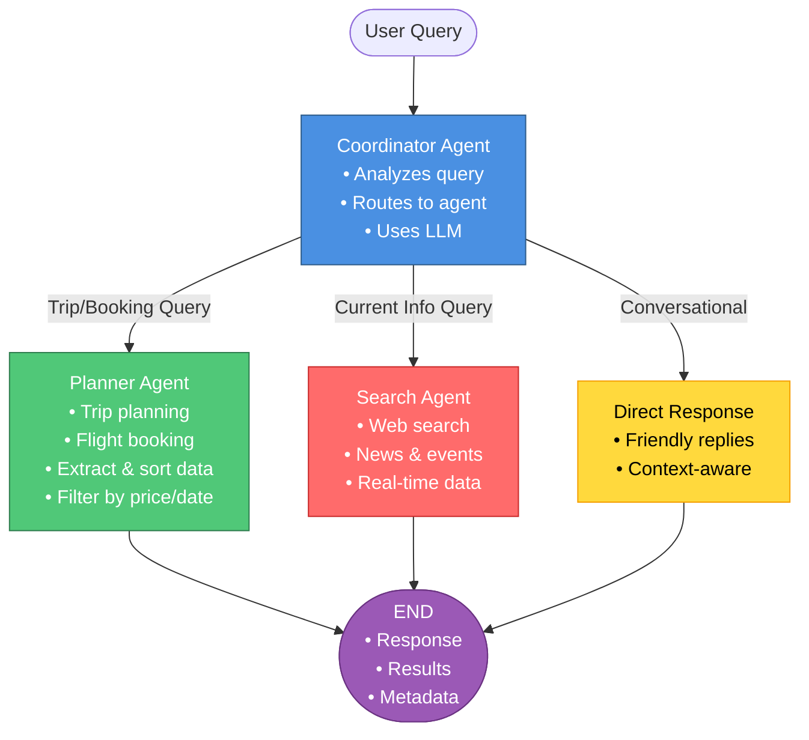

# Intelligent Agent System - Graph Architecture

## Visual Graph Representation

### Mermaid Diagram (Interactive)



### ASCII Diagram

```
                    ┌─────────────────────┐
                    │      START           │
                    │   (User Query)       │
                    └──────────┬───────────┘
                               │
                               ▼
                    ┌─────────────────────┐
                    │   COORDINATOR        │
                    │      AGENT           │
                    │                      │
                    │  • Analyzes query    │
                    │  • Routes to agent   │
                    │  • Uses LLM for      │
                    │    classification    │
                    └──────────┬───────────┘
                               │
                ┌──────────────┼──────────────┐
                │              │              │
                │              │              │
        ┌───────▼──────┐  ┌───▼──────┐  ┌───▼──────┐
        │   PLANNER    │  │  SEARCH  │  │   END    │
        │    AGENT     │  │  AGENT   │  │          │
        │              │  │          │  │ (Direct  │
        │ • Trip       │  │ • Web    │  │ Response)│
        │   planning   │  │   search │  │          │
        │ • Flight     │  │ • News   │  │          │
        │   booking    │  │ • Latest │  │          │
        │ • Extract    │  │   data   │  │          │
        │   & sort     │  │ • Real-  │  │          │
        │   data       │  │   time   │  │          │
        │ • Filter by  │  │   info   │  │          │
        │   price/date │  │          │  │          │
        └──────┬───────┘  └────┬─────┘  └──────────┘
               │               │
               │               │
               └───────┬───────┘
                       │
                       ▼
                ┌──────────────┐
                │     END      │
                │              │
                │  • Response  │
                │  • Results   │
                │  • Metadata  │
                └──────────────┘
```

## Agent Flow Details

### 1. Coordinator Agent (Entry Point)
- **Role**: Routes queries to appropriate agents
- **Decision Logic**: Uses LLM to classify query type
- **Routing Options**:
  - `planner_agent` → Trip planning, flight booking
  - `search_agent` → Current information, news, real-time data
  - `end` → Conversational queries (direct response)

### 2. Planner Agent
- **Role**: Handles trip planning and flight booking
- **Capabilities**:
  - Searches for flight/travel information
  - Extracts structured data from search results
  - Sorts flights by price (cheapest first)
  - Filters by dates
  - Provides booking links
- **Output**: Formatted flight list with prices and links

### 3. Search Agent
- **Role**: Performs web searches for current information
- **Capabilities**:
  - Uses Tavily for web search
  - Finds latest news, events, data
  - Provides real-time information
- **Output**: Search results with URLs and content

### 4. Direct Response (End)
- **Role**: Handles conversational queries
- **Capabilities**:
  - Generates friendly responses
  - Uses conversation history
  - Context-aware replies
- **Output**: Conversational response

## Routing Logic

```
Query → Coordinator Agent
         │
         ├─→ "Book trip" / "Flight prices" → Planner Agent
         │
         ├─→ "Who won?" / "Latest news" → Search Agent
         │
         └─→ "Hey" / "How are you" → Direct Response (End)
```

## State Flow

```
AgentState flows through:
1. Coordinator → Updates routing_decision
2. Specialized Agent → Updates results, context, response
3. End → Final state with all information
```

## Memory & Continuity

- **Thread ID**: Maintains conversation context
- **Checkpointer**: Persists state between queries
- **Message History**: Preserved across queries
- **Context**: Cleared per query, messages retained

## Example Flows

### Flow 1: Flight Booking Query
```
User: "Book trip to Bangkok, Dec 15-21"
  ↓
Coordinator → Routes to "planner_agent"
  ↓
Planner Agent:
  - Searches for flights
  - Extracts flight data
  - Sorts by price
  - Filters by dates
  ↓
Response: Sorted flight list with prices
```

### Flow 2: News Query
```
User: "Who won IPL in 2025?"
  ↓
Coordinator → Routes to "search_agent"
  ↓
Search Agent:
  - Searches web for current info
  - Gets latest results
  ↓
Response: Search results with URLs
```

### Flow 3: Conversational Query
```
User: "Hey how are you?"
  ↓
Coordinator → Routes to "end"
  ↓
Direct Response:
  - Generates friendly reply
  - Uses conversation history
  ↓
Response: "I'm doing great, thanks!"
```

## Graph Properties

- **Type**: StateGraph (LangGraph)
- **Checkpointer**: MemorySaver (in-memory persistence)
- **State Schema**: AgentState (TypedDict)
- **Entry Point**: Coordinator Agent
- **Exit Point**: END (after any agent completes)

## Agent Communication

All agents:
- Inherit from `BaseAgent`
- Have access to LLM
- Can use tools (if configured)
- Update shared `AgentState`
- Maintain conversation history

